[TOC]

# Python 语法基础

## Python 运行方式

### 交互解释器：进入交互解释器

Pycharm 里面有个 Terminal 终端，点击即可进入Python的交互环境

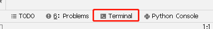

```shell
[root@localhost xxx] # python3
>>> print('hello world')  # 使用print函数输入“Hello world!”
hello world
>>> exit()  # 退出使用 exit() 或 Ctrl + D
```

### 文件形式：明确指定解释器

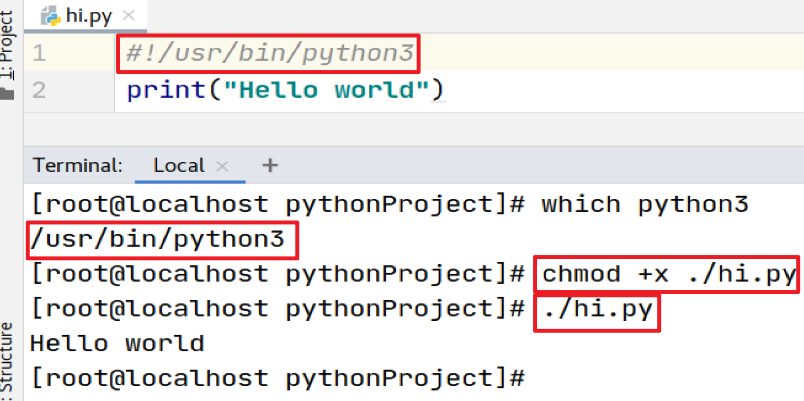

- **Terminal 终端运行**

  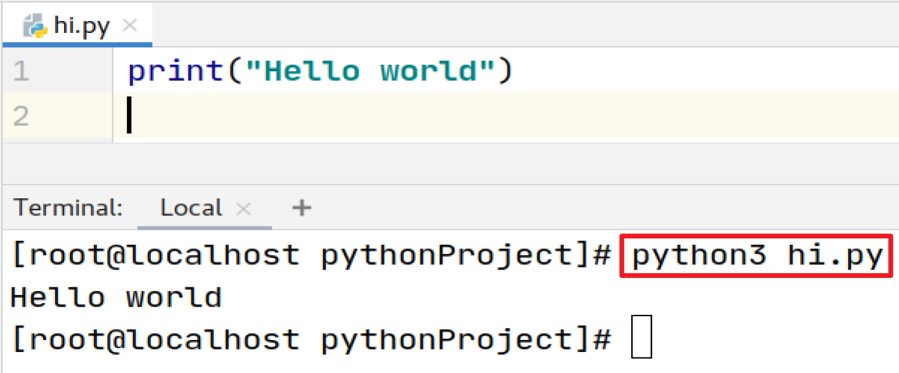


## Python 语法结构

### 语句块缩进

Python 代码块通过缩进对齐表达代码逻辑而不是使用大括号

- 缩进表达一个语句属于哪个代码块

- 缩进风格：4个空格：非常流行，范-罗萨姆支持的风格

- 缩进相同的一组语句构成一个代码块，称之代码组

**编写 hi.py：**

```python
print('Hello World!')
```

**缩进**

```python
#向右缩进时，按【Tab】键
#向左缩进时，先按【Shift】,再很快按【Tab】
#多行代码的缩进，选中，按如上操作即可
if 3 > 0:
    print('yes')
    print('ok')
```

- 代码的执行测试，可以直接在终端运行：

```shell
[root@localhost xxx]# python3 hi.py
```

- 右键点击代码页面任何位置，选择“Run hi”

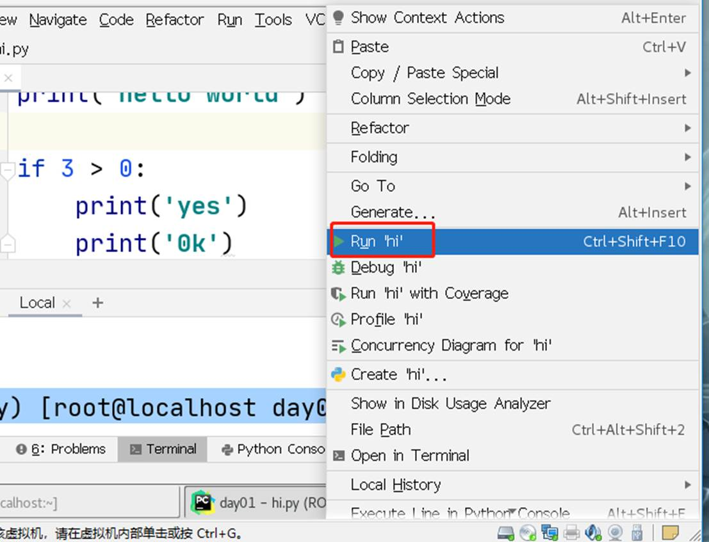

- 如果代码组只有一行，可以将其直接写在冒号后面，但是这样的写法可读性差，不推荐

```python
if 3 > 0: print('yes')
```

**注释（ctrl+？）及续行**

- 尽管Python 是可读性最好的语言之一，这并不意味着程序员在代码中就可以不写注释

- 和很多 UNIX 脚本类似，Python 注释语句从 # 字符开始

- 注释可以在一行的任何地方开始，解释器会忽略掉该行 # 之后的所有内容

- 一行过长的语句可以使用反斜杠 \ 分解成几行


 ```python
 # 在Python中的代码的注释，用"#"来实现
 # 代码过长时，用 "\" 代表折行, 代表含义：a = 'hello world' + 'hello tedu'
 
 a = 'hello world' + \
   'hello tedu'  3720.75
 ```

**同行多个语句**

- 分号：允许你将多个语句写在同一行上

- 但是些语句不能在这行开始一个新的代码块

- 因为可读会变差，所以不推荐使用

### 输出语句：print

```python
[root@localhost day01]# python3
>>> print('Hello World')  # 打印字符串Hello World，字符串要用引号引起来
Hello World
>>> print('Hello' + 'World')  # 先使用 + 将字符串Hello和World拼接起来，再输出拼接后的字符串
HelloWorld
>>> print('hao',123)  # 打印两个字符串hao和数字123, 默认以空格分开
hao 123
>>> print('hao',123,sep='***')  # 打印两个字符串hao和数字123, 修改默认分隔符为 ***
hao***123
```

 **输出语句：print 图例 **    "今天" + "天气不错"   拼接(首尾相连)   今天天气不错

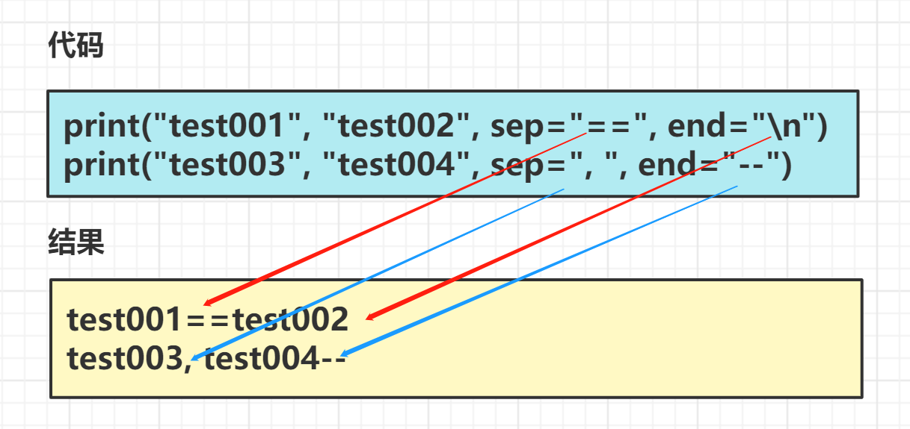

### 输入语句：input

```shell
[root@localhost xxx]# python3
>>> help(input)  # 查看print的帮助信息，按“Q”退出
input(prompt=None, /)
  Read a string from standard input. The trailing newline is stripped.
........

# 使用方式（注意：返回值一定是字符类型）
>>> input()  # 从键盘获取值
zhangsan
'zhangsan'
>>> input('username: ')  # 根据提示信息，从键盘获取值
username: zhangsan
'zhangsan'
# 根据提示信息，从键盘获取用户名，并赋值给user变量
# 变量的赋值，两边空格可有可无
>>> user = input('username: ')
username: zhangsan
>>> print(user)  # 打印user变量的值
zhangsan
# 通过input() 从键盘获取的值，一定是字符串类型的
# 字符串转换为数字类型，并进行运算
>>> num = input('number: ')  # 根据提示信息，从键盘获取值，并赋值给num变量
number: 10
>>> print(num)  # 打印num变量中的值
10
>>> num + 5  # input()获取的值都是字符类型的，字符串和数字不能参加运算
Traceback (most recent call last):
 File "<stdin>", line 1, in <module>
TypeError: must be str, not int
>>> int(num) + 5        #将num变量的值，转换成int类型，整数类型的两个值可以运算
15
# 数字类型转换为字符串，并进行拼接操作
>>> print(num)  # 打印num变量中的值
10
>>> num + str(5)  # 把star()函数将5转换成字符类型，和num变量中的值进行拼接
'105'
```

### 练习 1：模拟用户登陆

**需求**

1. 创建名为 login.py 的程序文件
2. 程序 **提示用户输入用户名**
3. 用户输入用户名后，打印 **欢迎用户**

 ```python
 # 根据提示信息，从键盘获取值，并赋值给user变量
 user = input('username: ')
 # 打印字符串welcome和user变量的值，默认以空格分开
 print('welcome', user)
 # 将字符串welcome和user变量的值进行拼接，打印拼接以后的值
 print('welcome' + user)
 ```

# 变量

## 概念理解

- 变量变量，也就是会变的量。它是一个装数据的容器，里面的数据是可以变的，因此叫变量
- 比如 "班长" 就是一个变量，这学期可能是李雷，那下学期就可能是韩梅梅了，老师想安排同学任务，想到的是班长，而非某个具体的同学

## 变量定义

* 在 Python 中，每个变量 **在使用前都必须赋值**，变量 **赋值以后** 该变量 **才会被创建**
* 等号（=）用来给变量赋值
  * `=` 左边是一个变量名
  * `=` 右边是存储在变量中的值

```python
变量名 = 值 
```

> 变量定义之后，后续就可以直接使用了

### 案例 1：定义变量

```python
# 定义 tmooc 账号变量
tmooc_account = "1234567@qq.com"

# 定义 tmooc 密码变量
tmooc_password = 123456

# 在程序中，如果要输出变量的内容，需要使用 print 函数
print(tmooc_account)
print(tmooc_password)
```

### 练习 1：买包子（变量：单价，数量，总价）

> * 可以用 **其他变量的计算结果** 来定义变量
> * 变量定义之后，后续就可以直接使用了

**需求**

* 包子的价格是 **1.5 元/个**
* 买了 **10 个** 包子
* 计算付款金额

```python
# 定义包子价格变量
price = 1.5
# 定义购买数量
number = 10
# 计算金额
money = price * number
print(money)
```

### 练习 2：买包子进阶

* 今天老板高兴，总价打 9 折
* 请重新计算购买金额

```python
# 定义包子价格变量
price = 1.5
# 定义购买数量
number = 10
# 计算金额
money = price * number
# 总价打 98 折
money = money * 0.9
print(money)
```

**提问**

* 上述代码中，一共定义有几个变量？
  * 三个：`price`／`number`／`money`
* `money = money * 0.9` 是在定义新的变量还是在使用变量？
  * 直接使用之前已经定义的变量
  * 变量名 只有在 **第一次出现** 才是 **定义变量**
  * 变量名 再次出现，不是定义变量，而是直接使用之前定义过的变量
* 在程序开发中，可以修改之前定义变量中保存的值吗？
  * 可以
  * 变量中存储的值，就是可以 **变** 的

## 变量的类型

在内存中创建一个变量，会包括：

1. 变量的名称
2. 变量保存的数据
3. 变量存储数据的类型
4. 变量的地址（标示）

## 运算符

Python 中所支持的运算符：

### 算术运算符

* 算数运算符是 **运算符的一种**
* 是完成基本的算术运算使用的符号，用来处理四则运算

| 运算符 |  描述  | 实例     15：06 上课                       |
| :----: | :----: | ------------------------------------------ |
|   +    |   加   | 10 + 20 = 30                               |
|   -    |   减   | 10 - 20 = -10                              |
|   *    |   乘   | 10 * 20 = 200                              |
|   /    |   除   | 10 / 20 = 0.5                              |
|   //   | 取整除 | 返回除法的整数部分（商） 9 // 2 输出结果 4 |
|   %    | 取余数 | 返回除法的余数 9 % 2 = 1                   |
|   **   |   幂   | 又称次方、乘方，2 ** 3 = 8                 |

**演示**

```python
>>> 5/3  # python中的除法运算
1.6666666666666667
>>> 5//3  # python中的取商运算
1
>>> 5 % 3  # python中的取余运算
2
```

### 比较运算符

| 运算符 | 描述                                                         |
| ------ | ------------------------------------------------------------ |
| ==     | 检查两个操作数的值是否 **相等**，如果是，则条件成立，返回 True |
| !=     | 检查两个操作数的值是否 **不相等**，如果是，则条件成立，返回 True   1 != 2  -> True |
| >      | 检查左操作数的值是否 **大于** 右操作数的值，如果是，则条件成立，返回 True |
| <      | 检查左操作数的值是否 **小于** 右操作数的值，如果是，则条件成立，返回 True |
| >=     | 检查左操作数的值是否 **大于或等于** 右操作数的值，如果是，则条件成立，返回 True |
| <=     | 检查左操作数的值是否 **小于或等于** 右操作数的值，如果是，则条件成立，返回 True |

**演示**

```python
>>> 5 > 3  # 比较两个数值的大小，5大于3, 为真
True
#  比较10是否小于15，并且15是否小于20，为真，不方便阅读，少用； 可写为：10 < 15 and 15 < 20
>>> 10 < 15 < 20
True
# 比较10是否小于15，并且15是否大于13，为真，可写为：10 < 15 and 15 > 13
>>> 10 < 15 > 13
True
```

### 逻辑运算符

| 运算符 | 逻辑表达式 | 描述                                                         |
| ------ | ---------- | ------------------------------------------------------------ |
| and    | x and y    | 只有 x 和 y 的值都为 True，才会返回 True<br />否则只要 x 或者 y 有一个值为 False，就返回 False |
| or     | x or y     | 只要 x 或者 y 有一个值为 True，就返回 <br />True只有 x 和 y 的值都为 False，才会返回 False |
| not    | not x      | 如果 x 为 True，返回 False<br />如果 x 为 False，返回 True   |

**演示**

```python
# and是且，同时满足的意思，两边必须同时满足才为【True】
>>> 5 > 3 and 10 > 5  # 5大于3，为真; 10大于5，也为真
True
# or是或者的意思，只要一边满足即为真 
>>> 5 > 3 or 10 > 50  # 5大于3，为真，结果为【True】
True
# not 取反
>>> not 5 > 3  # 5大于3，正确，为【True】，not取反，将其结果定义为【False】
False
>>> 10 > 50  # 10大于50，不正确，为【False】
False
>>> not 10 > 50  # 10大于50，不正确，为【False】；not取反，将其结果定义为【True】
True
```

## 数据类型

### 数字

基本的数字类型有：

- int：有符号整数
- bool：布尔值
  - True：1
  - False：0
- float：浮点数

```python
>>> type(5)  # 查看变量常量的类型，5为int 整数类型
<class 'int'>
>>> type(5.0)  # 查看变量常量的类型，5.0为float 浮点数类型
<class 'float'>
>>> True + 3  # True 代表的值为1，结果为4；True 第一个字母必须是大写
4
>>> False * 3  # False 代表的值为0，0乘任何数均为0；False 第一个字母必须是大写
0
```

**整数数字表示方式**

Python **默认以十进制数** 显示

1. 数字以 **0o 或 0O** 开头表示为 **8 进制数**
2. 数字以 **0x 或 0X** 开头表示 **16 进制数**
3. 数字以 **0b 或 0B** 开头表示 **2 进制数**

```python
# python 默认以十进制数显示，十进制数范围：0 ~ 9
>>> 23
23

# 以0o或0O开头表示8进制，0o23即将8进制数23，以十进制方法进行显示
# 8进制数23转为十进制方法: 2*8的1次方 + 3*8零次方 = 2*8 + 3*1 = 19
# 8进制数范围：0 ~ 7
>>> 0o23
19

# 以0x或0X开头表示16进制，0x23即将十六进制数23，以十进制方法进行显示
# 十六进制数23转为十进制方法: 2*16的1次方 + 2*16零次方 = 2*16 + 3*1 = 35
# 16进制数范围：0 ~ 9，a ~ f
>>> 0x23
35

# 以0b或0B开头表示二进制，0b10即将二进制数10，以十进制方法进行显示
# 十进制数10转为二进制方法: 1*2的1次方 + 0*2零次方 = 1*2 + 0*1 = 2
# 二进制数范围：0，1
>>> 0b10
2

>>> oct(100)  # 函数oct(), 可以将十进制数100，转换为8进制数
'0o144'
>>> hex(100)  # 函数hex(), 可以将十进制数100，转换为16进制数
'0x64'
>>> bin(100)  # 函数bin(), 可以将十进制数100，转换为二进制数
'0b1100100'
```

### 字符串

- Python 中字符串被定义为引号之间的字符集合
- Python 支持使用成对的单引号或双引号
- 无论单引号，还是双引号，表示的意义相同
- Python 还支持三引号（三个连续的单引号或者双引号），可以用来包含特殊字符
- Python 不区分字符和字符串

**演示**

```python
# 三引号的使用，保存用户输入的格式(原样输出)，可以是三个单引号，也可以是三个双引号
>>> users="""tom
... bob
... alice
... """

# 解决符号冲突
>>> sentance = "hello nfx, I'm your baby~"
>>> print(sentance)
hello nfx, I'm your baby~

# 解决符号冲突
>>> sentance = """hello "nfx", I'm your baby~"""
>>> print(sentance)
hello "nfx", I'm your baby~
```

#### 字符串索引和切片

- 使用索引运算符 [ ] 和 切片运算符 [ :   ] 可得到子字符串
- 第一个字符的索引是0，最后一个字符的索引是 -1
- 子字符串包含切片中的起始下标，但不包含结束下标

**图例**

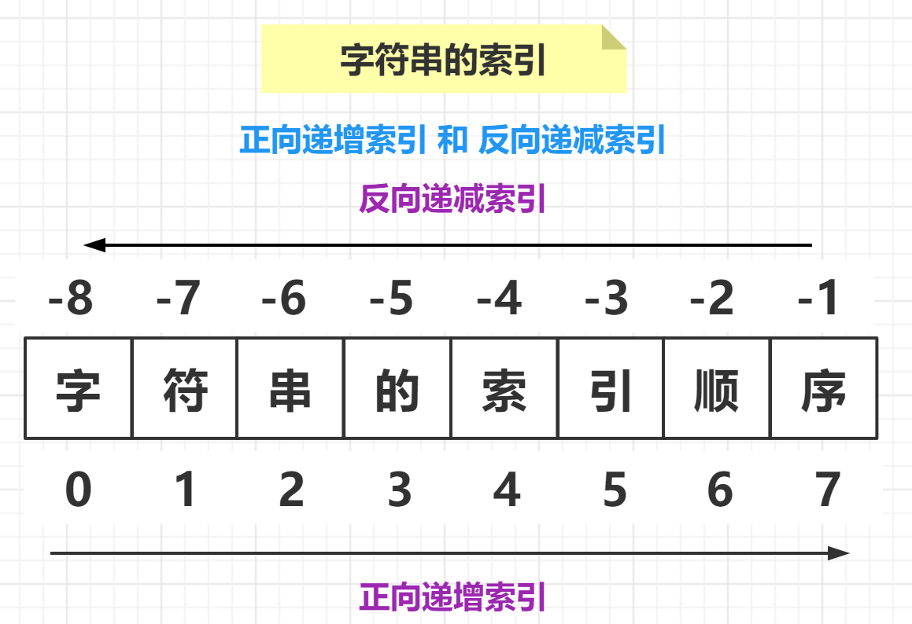

**演示**

```python
>>> py_str = 'python'  # 定义变量py_str, 值为python
>>> len(py_str)  # 使用函数len()，统计变量py_str的字符长度
6
>>> py_str[0]  # 默认字符的下标从0开始，取出变量py_str中的第一个字符p
'p'
>>> py_str[5]  # 取出变量py_str中的第六个字符n
'n'
>>> py_str[-1]  # 取出变量py_str的倒数第一个字符n
'n'
>>> py_str[-6]  # 取出变量py_str的倒数第六个字符n
'p'
```

#### 切片：字符串 [ 起始索引  :  终止索引  :   步长 ]

特点：含头去尾，能获取到 **起始索引** 位置上的元素，获取不到 **终止索引** 上的元素

**常规：只写头和尾，不写步长默认为1**

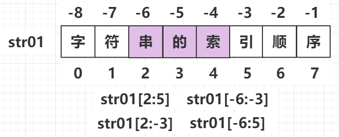

**从头切：起始索引不写，默认从头切**

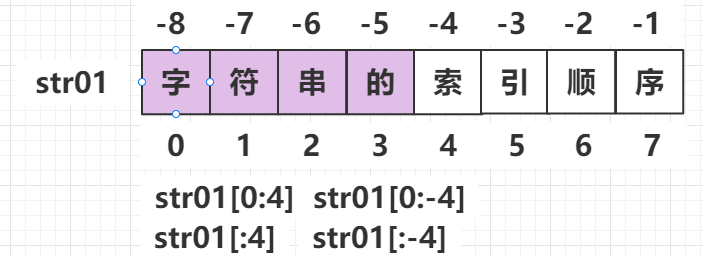

**切到尾：终止索引不写，默认切到尾**

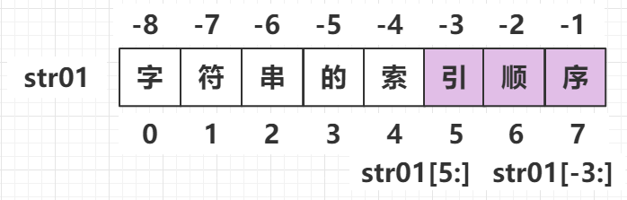

**头尾都不写：默认切全部，重新一个一模一样的字符串**

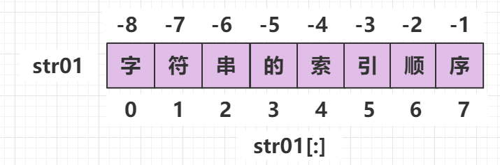

**加上步长切(案例1)**   腿长：1

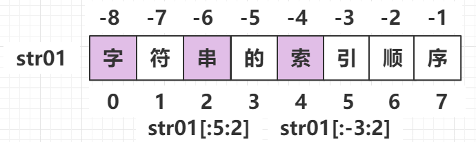

**加上步长切(案例2)**

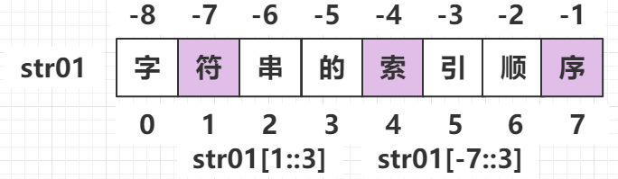

**倒着切**

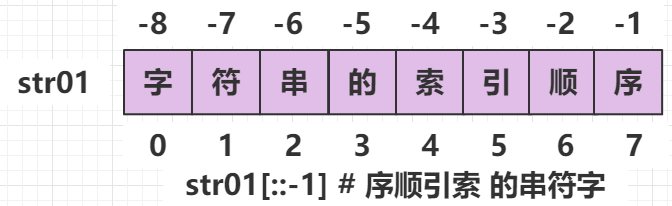

```python
# 取出变量py_str中，下标为2到下标为3之间的字符，下标为3的字符【h】不包含在内
>>> py_str[2:3]
't'
# 取出变量py_str中，下标为2到下标为4之间的字符，下标为4的字符【o】不包含在内
>>> py_str[2:4]
'th'
# 取出变量py_str中，下标为2到下标为5之间的字符，下标为5的字符【n】不包含在内
>>> py_str[2:5]
'tho'
# 取出变量py_str中，下标为2到下标为6之间的字符，6这个索引超过索引范围切到末尾
>>> py_str[2:6]
'thon'
>>> py_str[2:6000]  # 取出变量py_str中，下标为2字符之后的所有数据
'thon'
>>> py_str[2:]  # 取出变量py_str中，下标为2字符之后的所有数据
'thon'

# 取出变量py_str中，下标为0到下标为2之间的字符，下标为2的字符【t】不包含在内
>>> py_str[0:2]
'py'
>>> py_str[:]  # 取出变量py_str中的所有字符，没指定下标，则代表所有字符
'python'

# 设置步长为2，即第一次取值后，每次下标加2，然后取值，p下标为0; t下标为0+2=2; o下标为0+2+2=4 
>>> py_str[::2]
'pto'
# 设置步长为2，即第一次取值后，每次下标加2，然后取值，y下标为1; h下标为1+2=3; n下标为1+2+2=5 
>>> py_str[1::2]
'yhn'
>>> py_str[::-1]  # 设置步长为-1，即从后往前取值，没有设置结束位置，则取出变量中所有的值
'nohtyp'
```

#### 字符串连接操作

- 使用 + 号可以将多个字符串拼接在一起
- 使用 * 号可以将一个字符串重复多次

```python
>>> py_str = "python"
>>> py_str + ' is good'  # 将变量py_str中的值，和字符串'is good'进行拼接
'python is good'
# 字符串拼接时，注意要拼接的双方必须是都是字符串类型，否则报错
>>> py_str + 10
Traceback (most recent call last):
  File "<stdin>", line 1, in <module>
TypeError: must be str, not int

# 重复操作：使用 * 号可以将一个字符串重复多次，只能应用于字符串，数字则为乘法运算 
>>> '*' * 30  # 将字符串'*'重复打印30次，使用 * 号来完成
>>> '*' * 50  # 将字符串'*'重复打印30次，使用 * 号来完成
>>> py_str * 5  # 将变量py_str中的值，重复打印5次，使用 * 号来完成

# 字符串判断：in，not in判断字符是否处于变量的范围之内
>>> 't' in py_str  # 判断字符't',是否在变量py_str范围内，True 为真
True
>>> 'th' in py_str  # 判断字符串'th',是否在变量py_str范围内，True 为真
True

# 判断字符串'to',是否在变量py_str范围内，False 为假，这里'to'指的是一个连续的字符，不能分开看
>>> 'to' in py_str
False
>>> 'to' not in py_str  # 判断字符串'to',是否不在变量py_str范围内，True 为真
True
```

### 列表

#### 列表的定义

* `List`（列表） 是 `Python` 中使用 **最频繁** 的数据类型，在其他语言中通常叫做 **数组**

* 专门用于存储 **一串 信息**，它能保存 **任意数量，任意类型的 Python 对象**

* 列表用 `[]` 定义，**数据** 之间使用 `,` 分隔

* 列表中的项目 **可以改变**

* 列表的 **索引** 从 `0` 开始

  * **索引** 就是数据在 **列表** 中的位置编号，**索引** 又可以被称为 **下标**

* 类似于排队，**可动态变化**

  

> 注意：从列表中取值时，如果 **超出索引范围**，程序会报错

**演示**

```python
# 定义一个列表alist,一个列表中可以由字符串，可以有整数，也可以有子列表
>>> alist = [10, 20, 'tom','alice', [1,2]]
>>> len(alist)  # 使用函数len()，可以查看列表的长度，即以逗号分割的元素的多少
5
# 列表也是以下标取元素，默认开始下标为0，取出列表alist中的第一个元素，为10
>>> alist[0]
10
>>> alist[-1]  # 取出列表alist中，倒数第一个元素，为子列表[1,2]
[1, 2]

>>> alist[2:4]  # 取出列表alist中，第二个到第四个元素，下标为4的元素不包含
['tom', 'alice']
>>> 'tom' in alist  # 字符串'tom'是否在列表alist范围之内
True

# 列表的拼接和重新赋值
>>> alist  # 查看列表alist中的值
>>> type(alist)  # 查看列表alist的数据类型，为list类型
<class 'list'>
>>> type(100)  # 查看100的数据类型，为int类型
<class 'int'>
>>> alist + 100  # 列表在拼接时，必须是相同类型【均为list类型】，才可以完成拼接
Traceback (most recent call last):
  File "<stdin>", line 1, in <module>
TypeError: can only concatenate list (not "int") to list
>>> alist + [100]  # 完成拼接，只是输出拼接后的结果，不会改变列表alist的组成
>>> alist[-1]  # 查看列表alist最后一个元素的值
[1,2]
>>> alist[-1] = 100  # 修改列表alist最后一个元素的值为100
>>> alist[-1]  # 查看列表alist最后一个元素的值，验证结果
100
>>> alist  # 查看列表alist中的所有元素
```

#### 列表操作
- 使用 in 或 not  in 判断成员关系
- 使用 append 方法向列表中追加元素

```python
>>> 10 in alist	  # 判断10, 是否在列表alist范围之内，为真
True
>>> 'alice' not in alist  # 判断alice, 是否不在列表alist范围之内，为假
False
>>> 'tom' not in alist  # 判断字符串tom, 是否不在列表alist范围之内，为假
False

# alist.<Tab><Tab>可以显示alist可以使用的方法
>>> alist.append(200)  # 向列表alist中，追加一个元素200
>>> alist
```

