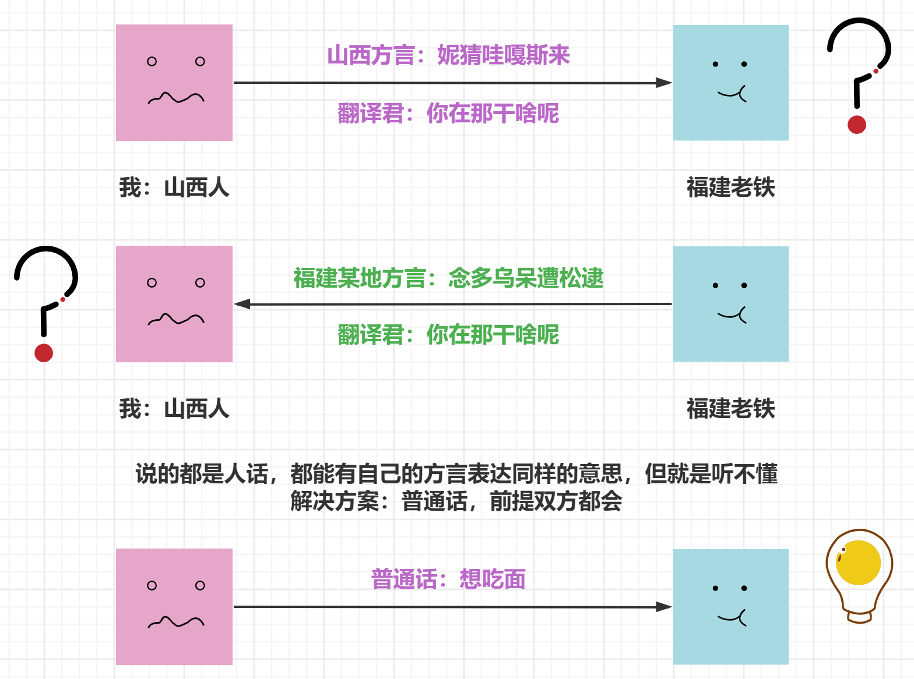
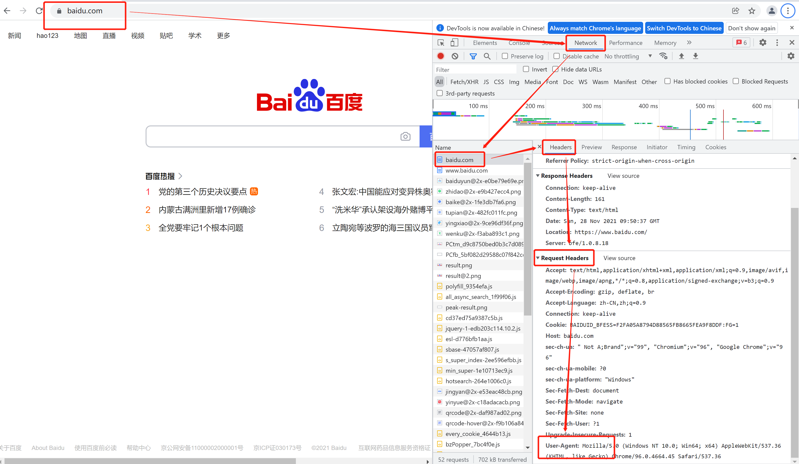

[TOC]

# PyMySQL

## 准备数据库

1. 安装 mariadb-server
2. 启动服务
3. 创建名为 tedu1 的数据库【utf8】

```shell
[root@localhost ~]# yum -y install gcc
[root@localhost ~]# yum -y install mariadb-server
[root@localhost ~]# systemctl start mariadb
[root@localhost ~]# systemctl enable mariadb
[root@localhost ~]# ss -ntulp | grep mysql
[root@localhost ~]# mysql
MariaDB [(none)]> CREATE DATABASE tedu1 DEFAULT CHARSET utf8;  # 创建数据库tedu1, 指定字符集为utf8【数据库命令不区分大小写】
```

## PyMySQL 模块应用

### 连接数据库

创建连接是访问数据库的第一步

```python
import pymysql
conn = pymysql.connect(
    host='127.0.0.1', 
    port=3306, 
    user='root',
    db='tedu1', 
    charset='utf8'
)
```

### 游标

- 游标（cursor）就是游动的标识

- 通俗的说，一条sql取出对应n条结果资源的接口/句柄，就是游标，沿着游标可以一次取出一行

```python
cur = conn.cursor()  # 创建游标【对数据库进行增删改查】
```

### 创建表

```python
# 建立部门表，员工表，工资表
# 定义创建departments【部门表】sql命令
create_dep = '''CREATE TABLE departments(
	dep_id INT, dep_name VARCHAR(50)
)'''
cur.execute(create_dep)  # 执行sql语句create_dep
```

### 插入数据

对数据库表做修改操作，必须要 **commit**

```python
#向部门表中插入数据
insert_dep = 'INSERT INTO departments VALUES (%s, %s)'	# 定义插入数据的变量，%s为占位符
cur.execute(insert_dep, (1, '人事部'))  # 执行sql语句insert_dep, 插入一条记录
cur.executemany(  # executemany(), 执行sql语句insert_dep, 同时插入多条记录
    insert_dep, 
    [(2, '运维部'), (3, '开发部'), (4, '测试部'), (5, '财务部'), (6, '市场部')]
)
conn.commit()
```

### 查询数据

可以取出表中一条、多条或全部记录

```python
sql4 = "SELECT * FROM departments"
cur.execute(sql4)
result = cur.fetchone()
print(result)

result2 = cur.fetchmany(2)
print(result2)

result3 = cur.fetchall()
print(result3)
```

### 修改数据

通过 update 修改某一字段的值

```python
# 更新部门表【departments】中的数据
update_dep = 'UPDATE departments SET dep_name=%s WHERE dep_name=%s'
cur.execute(update_dep, ('人力资源部', '人事部'))
conn.commit()
```

### 删除记录

通过 delete 删除记录

```python
#删除部门表【departments】中的id为6的数据
del_dep = 'DELETE FROM departments WHERE  dep_id=%s'
cur.execute(del_dep, (6,))
conn.commit()
```

## 练习 ：员工表 (EMPLOYEE) 相关操作

**需求**：

1. 员工表有 FIRST_NAME VARCHAR(20)，LAST_NAME VARCHAR(20)，AGE INT，SEX VARCHAR(1)，INCOME FLOAT字段
2. 使用 PyMySQL 创建该表
3. 使用 PyMySQL 添加以下三条数据
   1. 'Mac', 'A', 20, 'M', 20000
   2. 'Tom', 'B', 20, 'F', 30000
   3. 'Bob', 'C', 20, 'M', 40000
4. 使用 PyMySQL 查询所有用户信息，并打印结果
5. 将 FIRST_NAME  为 Mac 的用户工资改成 10000
6. 删除 FIRST_NAME  为 Tom 的用户信息

```python
import pymysql
# 打开数据库连接
db = pymysql.connect(
    host='127.0.0.1', 
    port=3306, 
    user='root',
    db='tedu1', 
    charset='utf8'
)
# 使用 cursor() 方法创建一个游标对象 cursor
cur = db.cursor()

##########################################################
# 创建表
sql = """CREATE TABLE EMPLOYEE (
    FIRST_NAME  VARCHAR(20) NOT NULL,
    LAST_NAME  VARCHAR(20),
    AGE INT,  
    SEX VARCHAR(1),
    INCOME FLOAT 
)"""
cur.execute(sql)
##########################################################
# SQL 插入语句
sql = """INSERT INTO EMPLOYEE(FIRST_NAME,
         LAST_NAME, AGE, SEX, INCOME)
         VALUES (%s, %s, %s, %s, %s)"""
cur.executemany(  # executemany(), 执行sql语句, 同时插入多条记录
    sql, [
        ('Mac', 'A', 20, 'M', 20000), 
        ('Tom', 'B', 20, 'F', 30000), 
        ('Bob', 'C', 20, 'M', 40000)
    ]
)
db.commit()
##########################################################
sql = "SELECT * FROM EMPLOYEE"
cur.execute(sql)
result = cur.fetchone()
print(result)
result2 = cur.fetchmany(2)
print(result2)
##########################################################
sql = 'UPDATE EMPLOYEE SET INCOME=%s WHERE FIRST_NAME=%s'
cur.execute(sql, (10000, 'Mac'))
db.commit()
##########################################################
sql = 'DELETE FROM EMPLOYEE WHERE FIRST_NAME=%s'
cur.execute(sql, ("Tom",))
db.commit()
# 关闭数据库连接
cur.close()
db.close()
```

# JSON

## 概念

**JSON** 是一种轻量级的数据交换格式。

## 理解

数据交换格式那么多，为啥还要学个 **JSON？**



数据交换格式是不同平台、语言中进行数据传递的通用格式。比如 **Python** 和 **Java** 之间要对话，你直接传递给 **Java** 一个 **dict 或 list** 吗？**Java** 会问，这是什么鬼？虽然它也有字典和列表数据类型，但两种字典不是一个“物种”，根本无法相互理解。这个时候就需要用 **Json** 这种交换格式了，**Python** 和 **Java** 都能理解 **Json**。那么别的语言为什么能理解 **Json** 呢？因为这些语言都内置或提供了 **Json** 处理模块，比如 **Python** 的 **json** 模块。

## 基本用法

**JSON格式：** 在各种语言中，都可以被读取，被用作不同语言的中间转换语言【类似翻译器】

### 主要结构

- “键/值” 对的集合；python 中主要对应 **字典**

- 值的有序列表；在大部分语言中，它被理解为 **数组**

| **Python**  | **JSON** |
| ----------- | -------- |
| dict        | object   |
| list, tuple | array    |
| str         | string   |
| int, float  | number   |
| True        | true     |
| False       | false    |
| None        | null     |

### 常用函数

- **loads 方法**：对编码后的 **json** 对象进行 **decode** 解密，得到原始数据，需要使用的 **json.loads()** 函数

- **dumps 方法：**可以将原始数据转换为 **json** 格式

### 案例

```python
[root@localhost xxx]# python3
>>> import json  # 导入json模块
>>> adict = {'user': 'tom', 'age': 20}  # 定义字典adict
>>> data = json.dumps(adict)  # dumps()，将字典转换为json格式【字符串类型】，赋值给变量data
>>> data  # 查看变量的内容，字符串
>>> type(data)  # 查看变量data的数据类型，为字符串类型
>>> jdata = json.loads(data)  # l将json格式【字符串类型】转换为字典，赋值给变量jdata
>>> jdata  # 查看变量data的值，字典
>>> type(jdata)  # 查看jdata的数据类型，为字典类型
```

# requests 模块

## requests 简介

1. requests 是用 Python 语言编写的、优雅而简单的 HTTP 库

2. requests 内部采用来 urillib3

3. requests 使用起来肯定会比 urillib3 更简单便捷

4. requests 需要单独安装

## GET 和 POST

- 通过 requests 发送一个 GET 请求，需要在 URL 里请求的参数可通过 params 传递
- 与 GET 不同的是，POST 请求新增了一个可选参数 data，需要通过 POST 请求传递 body 里的数据可以通过 data 传递

### requests 发送 GET 请求

#### 案例 1：处理文本数据

```python
[root@localhost xxx]# pip3 install requests  # 安装requests软件包
# 使用requests处理文本数据，使用text查看【get】
[root@localhost xxx]# python3
>>> import requests  # 导入requests模块
>>> url = 'http://www.163.com'	# 声明变量，定义要操作的网页
>>> r = requests.get(url)  # 请求，获取网页内容，赋值给变量r
>>> r.text  # 查看网页内容，因为是文本类型的，采用text查看
```

#### 案例 2：处理图片视频音频等数据

```python
>>> url2 = 'http://pic1.win4000.com/wallpaper/6/58f065330709a.jpg'  # 声明变量，定义查看的图片
>>> r2 = requests.get(url2)  # 请求，获取bytes类型的图片数据，赋值给变量r
>>> r2.content  # 查看图片内容，因为是图片类型的，采用content查看
>>> with open('/tmp/aaa.jpg', 'wb') as fobj:  # 将图片数据保存在文件aaa.jpg中
...     fobj.write(r2.content)
[root@localhost xxx]# eog /tmp/aaa.jpg 		#在终端使用eog打开图片aaa.jpg
```

#### 案例 3：处理 json 格式的数据

**天气预报查询**

- 搜索 **中国天气网  城市代码查询**， 查询城市代码
- 城市天气情况接口
  - 实况天气获取： http://www.weather.com.cn/data/sk/城市代码.html

```python
>>> url3 = 'http://www.weather.com.cn/data/sk/101130101.html'  # 声明变量，指定乌鲁木齐城市天气的网页路径
>>> r3 = requests.get(url3)  # 请求，获取bytes类型的图片数据，赋值给变量r
>>> r3.json()  # json(), 查看json类型的数据，乱码【字符集错误】
>>> r3.encoding  # 查看获取网页数据的字符集
'ISO-8859-1'
>>> r3.encoding = 'utf8'  # 将网页数据，转换为'utf8'格式
>>> r3.json()  # json(), 查看json类型的数据【utf8】
```

### 设定头部

- 用户也可以自己设定请求头
- 获取网站的【User-Agent】请求头信息



```python
# 用户自己设定请求头，查看Forbidden禁止访问的网站
[root@localhost xxx]# python3
>>> js_url = 'http://www.jianshu.com'				#声明变量，指定简书的网站
>>> headers = {'User-Agent': 'Mozilla/5.0 (Windows NT 10.0; Win64; x64) AppleWebKit/537.36 (KHTML, like Gecko) Chrome/96.0.4664.45 Safari/537.36'}					#声明访问网站的请求头
>>> r = requests.get(js_url, headers=headers)		#获取简书网页数据, 自定义请求头
>>> r.text			#以文本的方式，查看数据内容【Forbidden 简书网站进行了反爬虫设置】

```

### 请求参数

- 当访问一个 URL 时，我们经常需要发送一些查询的字段作为过滤信息，例如：httpbin.com/get?key=val，这里的 key=val 就是限定返回条件的参数键值对
- 当利用 python 的 requests 去发送一个需要包含这些参数键值对时，可以将它们传给params

```python
import requests
headers = {
	'User-Agent': 'Mozilla/5.0 (Windows NT 10.0; Win64; x64) AppleWebKit/537.36 (KHTML, like Gecko) Chrome/96.0.4664.45 Safari/537.36'
}
# 这是目标url
# url = 'https://www.baidu.com/s?wd=python'
url = 'https://www.baidu.com/s?'
# 请求参数是一个字典 即wd=python
kw = {'wd': 'python'}
# 带上请求参数发起请求，获取响应
response = requests.get(url, headers=headers, params=kw)
print(response.text)
```

