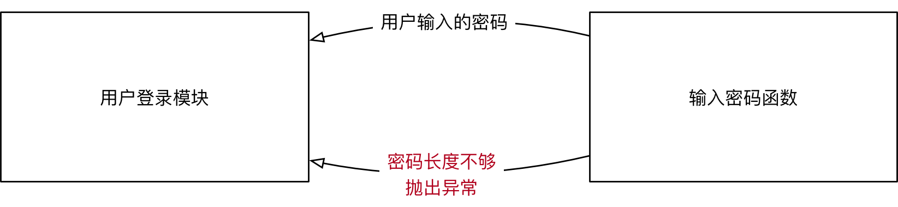

[TOC]

# 时间模块

## time 模块

### 时间表示方式

- **时间戳 timestamp：**表示的是从 1970 年1月1日 00:00:00 开始按秒计算的偏移量

- **UTC（Coordinated Universal Time, 世界协调时）**亦即格林威治天文时间，世界标准时间。在中国为 UTC+8  DST(Daylight Saving Time) 即夏令时；

- **元组（struct_time）**： 由 9 个元素组成，九元组

### 结构化时间（struct_time）

使用 `time.localtime()` 等方法可以获得一个结构化时间元组。

```python
>>> import time
>>> time.localtime()
time.struct_time(tm_year=2021, tm_mon=9, tm_mday=1, tm_hour=14, tm_min=23, tm_sec=29, tm_wday=2, tm_yday=244, tm_isdst=0)
```

结构化时间元组共有9个元素，按顺序排列如下表：

| 索引 | 属性                      | 取值范围           |
| ---- | ------------------------- | ------------------ |
| 0    | tm_year（年）             | 比如 2021          |
| 1    | tm_mon（月）              | 1 - 12             |
| 2    | tm_mday（日）             | 1 - 31             |
| 3    | tm_hour（时）             | 0 - 23             |
| 4    | tm_min（分）              | 0 - 59             |
| 5    | tm_sec（秒）              | 0 - 59             |
| 6    | tm_wday（weekday）        | 0 - 6（0表示周一） |
| 7    | tm_yday（一年中的第几天） | 1 - 366            |
| 8    | tm_isdst（是否是夏令时）  | 默认为-1           |

然结构化时间是一个元组，那么就可以通过索引进行取值，也可以进行分片，或者通过属性名获取对应的值。

```python
>>> import time
>>> t = time.localtime()
>>> t
time.struct_time(tm_year=2021, tm_mon=9, tm_mday=1, tm_hour=14, tm_min=23, tm_sec=29, tm_wday=2, tm_yday=244, tm_isdst=0)
>>> t[3]
14
>>> t[1:3]
(9, 1)
>>> t.tm_mon
9
```

**注意**

但是要记住，**Python的time类型是不可变类型，所有的时间值都只读，不能改**

```python
>>> t.tm_mon = 2
Traceback (most recent call last):
  File "<stdin>", line 1, in <module>
AttributeError: readonly attribute
```

### 格式化时间字符串

利用 `time.strftime('%Y-%m-%d %H:%M:%S')` 等方法可以获得一个格式化时间字符串

```python
>>> import time
>>> time.strftime('%Y-%m-%d %H:%M:%S')
'2021-09-01 02:39:23'
```

注意其中的空格、短横线和冒号都是美观修饰符号，真正起控制作用的是百分符

对于格式化控制字符串 `"%Y-%m-%d %H:%M:%S`，其中每一个字母所代表的意思如下表所示，注意大小写的区别：

| 格式 | 含义                                    | 格式 | 含义                                              |
| ---- | --------------------------------------- | ---- | ------------------------------------------------- |
| %a   | 本地简化星期名称                        | %m   | 月份（01 - 12）                                   |
| %A   | 本地完整星期名称                        | %M   | 分钟数（00 - 59）                                 |
| %b   | 本地简化月份名称                        | %p   | 本地am或者pm的相应符                              |
| %B   | 本地完整月份名称                        | %S   | 秒（01 - 59）                                     |
| %c   | 本地相应的日期和时间                    | %U   | 一年中的星期数（00 – 53，星期日是一个星期的开始） |
| %d   | 一个月中的第几天（01 - 31）             | %w   | 一个星期中的第几天（0 - 6，0是星期天）            |
| %H   | 一天中的第几个小时（24小时制，00 - 23） | %x   | 本地相应日期                                      |
| %I   | 第几个小时（12小时制，01 - 12）         | %X   | 本地相应时间                                      |
| %j   | 一年中的第几天（001 - 366）             | %y   | 去掉世纪的年份（00 - 99）                         |
| %Z   | 时区的名字                              | %Y   | 完整的年份                                        |

### time 模块主要方法

**1. time.sleep(t)**

time 模块最常用的方法之一，用来睡眠或者暂停程序t秒，t可以是浮点数或整数。

**2. time.time()**

返回当前系统时间戳。时间戳可以做算术运算。

```python
>>> time.time()
1630478727.255702
```

该方法经常用于计算程序运行时间：

```python
import time

def func():
    time.sleep(1.14)
    pass

t1 = time.time()
func()
t2 = time.time()
print(t2 - t1)

# print(t2 + 100)    
# print(t1 - 10)
# print(t1*2)
```

**3. time.gmtime([secs])**

将一个时间戳转换为 **UTC时区的结构化时间**。可选参数secs的默认值为 `time.time()`。

```python
>>> time.gmtime()
time.struct_time(tm_year=2021, tm_mon=9, tm_mday=1, tm_hour=6, tm_min=46, tm_sec=52, tm_wday=2, tm_yday=244, tm_isdst=0)
>>> t = time.time() - 10000
>>> time.gmtime(t)
time.struct_time(tm_year=2021, tm_mon=9, tm_mday=1, tm_hour=4, tm_min=0, tm_sec=22, tm_wday=2, tm_yday=244, tm_isdst=0)
```

**4. time.localtime([secs])**

将一个时间戳转换为 **当前时区** 的结构化时间。如果secs参数未提供，则以当前时间为准，即`time.time()`。

```python
>>> time.localtime()
time.struct_time(tm_year=2021, tm_mon=9, tm_mday=1, tm_hour=2, tm_min=47, tm_sec=29, tm_wday=2, tm_yday=244, tm_isdst=1)
>>> time.localtime(1406391907)
time.struct_time(tm_year=2014, tm_mon=7, tm_mday=26, tm_hour=12, tm_min=25, tm_sec=7, tm_wday=5, tm_yday=207, tm_isdst=1)
>>> time.localtime(time.time() + 10000)
time.struct_time(tm_year=2021, tm_mon=9, tm_mday=1, tm_hour=5, tm_min=35, tm_sec=1, tm_wday=2, tm_yday=244, tm_isdst=1)
>>> 
```

**5. time.mktime(t)**

将一个结构化时间转化为时间戳。`time.mktime()`执行与`gmtime()`，`localtime()`相反的操作，它接收 `struct_time` 对象作为参数,返回用秒数表示时间的浮点数。如果输入的值不是一个合法的时间，将触发 `OverflowError `或  `ValueError`。

```python
time(1406391907)
Traceback (most recent call last):
  File "<stdin>", line 1, in <module>
TypeError: Tuple or struct_time argument required
>>> time.mktime(time.localtime())
1630479471.0
```

**6. time.strftime(format [, t])**

返回格式化字符串表示的当地时间。把一个`struct_time`（如`time.localtime()`和`time.gmtime()`的返回值）转化为格式化的时间字符串，显示的格式由参数`format`决定。如果未指定t，默认传入`time.localtime()`。

```python
>>> time.strftime("%Y-%m-%d %H:%M:%S")
'2021-09-01 02:58:16'
>>> time.strftime("%Y-%m-%d %H:%M:%S", time.gmtime())
'2021-09-01 06:58:31'
```

**7. time.strptime(string[,format])**

**将格式化时间字符串转化成结构化时间**

- 该方法是 `time.strftime()`方法的逆操作。
- `time.strptime()` 方法根据指定的格式把一个时间字符串解析为时间元组。
- 提供的字符串要和 **format参数** 的格式一一对应
  - 如果string中日期间使用 “-” 分隔，format中也必须使用“-”分隔
  - 时间中使用冒号 “:” 分隔，后面也必须使用冒号分隔
- 并且值也要在合法的区间范围内

```python
>>> import time
>>> stime = "2021-09-01 15:09:30"
>>> st = time.strptime(stime,"%Y-%m-%d %H:%M:%S")
>>> st
time.struct_time(tm_year=2021, tm_mon=9, tm_mday=1, tm_hour=15, tm_min=9, tm_sec=30, tm_wday=2, tm_yday=244, tm_isdst=-1)
>>> for item in st:
...     print(item)
... 
2021
9
1
15
9
30
2
244
-1
>>> wrong_time = "2021-14-26 12:11:30"
>>> st = time.strptime(wrong_time,"%Y-%m-%d %H:%M:%S")
Traceback (most recent call last):
  File "<stdin>", line 1, in <module>
  File "/usr/lib64/python3.6/_strptime.py", line 559, in _strptime_time
    tt = _strptime(data_string, format)[0]
  File "/usr/lib64/python3.6/_strptime.py", line 362, in _strptime
    (data_string, format))
ValueError: time data '2021-14-26 12:11:30' does not match format '%Y-%m-%d %H:%M:%S'
```

### 时间格式之间的转换

Python的三种类型时间格式，可以互相进行转换

| 从             | 到             | 方法        |
| -------------- | -------------- | ----------- |
| 时间戳         | UTC结构化时间  | gmtime()    |
| 时间戳         | 本地结构化时间 | localtime() |
| 本地结构化时间 | 时间戳         | mktime()    |
| 结构化时间     | 格式化字符串   | strftime()  |
| 格式化字符串   | 结构化时间     | strptime()  |


## 练习：取出指定时间段的日志

**需求**

1. 有一日志文件，按时间先后顺序记录日志

2. 给定 **时间范围**，取出该范围内的日志

3. 自定义日志文件 **myweb.log**

   ```shell
   [root@localhost ~]# vim /opt/myweb.log
   2030-01-02 08:01:43 aaaaaaaaaaaaaaaaa
   2030-01-02 08:34:23 bbbbbbbbbbbbbbbbbbbb
   2030-01-02 09:23:12 ccccccccccccccccccccc
   2030-01-02 10:56:13 ddddddddddddddddddddddddddd
   2030-01-02 11:38:19 eeeeeeeeeeeeeeee
   2030-01-02 12:02:28 ffffffffffffffff
   ```

【方案一】

```python
# 取出指定时间段 [9点~12点] 的行
import time
# strptime(), 将字符时间'2030-01-02 09:00:00'，转换成时间对象
t9 = time.strptime('2030-01-02 09:00:00', '%Y-%m-%d %H:%M:%S')
t12 = time.strptime('2030-01-02 12:00:00', '%Y-%m-%d %H:%M:%S')

# 读取日志文件myweb.log中的数据
with open('myweb.log', mode="r") as fobj:
    for line in fobj.readlines():
        # strptime(), 将line[:19]截取的字符时间，转换成时间对象
        t = time.strptime(line[:19], '%Y-%m-%d %H:%M:%S')  
        if t9 <= t <= t12:  # 此种判断会遍历日志文件中的每一行，有可能执行大量无效操作，效率低下
            print(line, end='')
```

【方案二】

```python
# 日志文件中，时间点是从前往后不断增加的，所以只要遍历到有一行时间超过预计，则后面的所有行均是不满足条件的
import  time
# strptime(), 将字符时间'2030-01-02 09:00:00'，转换成时间对象
t9 = time.strptime('2030-01-02 09:00:00', '%Y-%m-%d %H:%M:%S')
t12 = time.strptime('2030-01-02 12:00:00', '%Y-%m-%d %H:%M:%S')

with open('myweb.log', mode="r") as fobj:  # 读取日志文件myweb.log中的数据，逐行进行遍历
    for line in fobj.readlines():
        # strptime(), 将line[:19]截取的字符时间，转换成时间对象
        t = time.strptime(line[:19], '%Y-%m-%d %H:%M:%S')
        if t > t12:  # 当时间大于12点时，退出循环
            break
        if t >= t9:  # 当时间大于9点时，打印对应行
            print(line, end='')

```


# 异常    处理

## 什么是异常

程序在运行时，如果 `Python 解释器` **遇到** 到一个错误，**会停止程序的执行，并且提示一些错误信息**，这就是 **异常**

异常是因为程序出现了错误，而在正常控制流以外采取的行为

- 这个行为又分为两个阶段：
  - 首先是引起异常发生的错误
  - 然后是检测（和采取可能的措施）阶段

## Python 中的异常

当程序运行时，因遇到未解的错误而导致中止运行，便会出现 **traceback** 消息，打印异常

```python
KeyboardInterrupt     # Ctrl + C，会产生用户中断执行错误
EOFError              # Ctrl + D，会产出此错误
```

### python 中异常演示

```python
>>> a + 5							# NameError，变量a没有定义
>>> 'hello'[5]						# IndexError，字符串hello的最长索引下标为4
>>> a = 10			
>>> if a = 10:						# SyntaxError，python中的等于号使用'=='表示
>>> n = input('number:' )			# 要求输入number时，Ctrl + D, 产生EOFError
>>> n = input('number: ')			# Ctrl + C，产生KeyboardInterrupt，用户中断执行
```

### 错误类型捕获

* 在程序执行时，可能会遇到 **不同类型的异常**，并且需要 **针对不同类型的异常，做出不同的响应**，这个时候，就需要捕获错误类型了
* 语法如下：

```python
try:
    # 尝试执行的代码
    pass
except 错误类型1:
    # 针对错误类型1，对应的代码处理
    pass
except (错误类型2, 错误类型3):
    # 针对错误类型2 和 3，对应的代码处理
    pass
except Exception as result:
    print("未知错误 %s" % result)
```

#### try-except 语句

- 定义了进行异常监控的一段代码，并且提供了处理异常的机制

```python
try:
    n = int(input('number: '))  # 没有输入任何值，回车，产生ValueError异常
    print(n)
except ValueError:
    print('无效的输入')  # 当异常ValueError发生时，执行print()
```

#### 带有多个 excepct 的 try 语句

- 可以把多个 except 语句连接在一起，处理一个try 块中可能发生的多种异常

```python
# 使用多个excepct 的try语句，处理异常
try:
    n = int(input('number: '))  # 没有输入任何值，回车，产生ValueError异常
    print(n)
except ValueError:  # 当异常ValueError发生时，执行print()
    print('无效的输入')
except KeyboardInterrupt:  # Ctrl + C，产生KeyboardInterrupt，用户中断执行
    print('\nBye-bye')
except EOFError:  # Ctrl + D, 产生EOFError, 没有内建输入
    print('\nBye-bye')
```

- 检测上述模块中异常处理结果

```python
[root@localhost xxx] # python3 day01.py 
number:  # 回车，ValueError异常，s输入错误类型
无效的输入
[root@localhost xxx] # python3 day01.py 
number: ^CBye-bye  # Ctrl + C，KeyboardInterrupt异常，用户操作中断
[root@localhost xxx]# python day01.py 
number: Bye-bye  # Ctrl + D, EOFError异常, 没有内建输入
```

#### 捕获未知错误

* 在开发时，**要预判到所有可能出现的错误**，还是有一定难度的
* 如果希望程序 **无论出现任何错误**，都不会因为 `Python` 解释器 **抛出异常而被终止**，可以再增加一个 `except`

语法如下：

```python
except Exception as result:
    print("未知错误 %s" % result)
```

### 异常参数

- 异常也可以有参数，异常引发后它会被传递给异常处理器

- 当异常被引发后参数是作为附加帮助信息传递给异常处理器的

**查看异常提示信息**

```python
>>> n = int(input('number: '))
number:  # 回车，ValueError异常
Traceback (most recent call last):
  File "<stdin>", line 1, in <module>
ValueError: invalid literal for int() with base 10: ''
```

**使用多个except的try语句，实现异常参数**

```python
try:
    n = int(input('number: '))    
    print(n)
except ValueError as e:  # 当异常ValueError发生时，将异常信息赋值给变量e
    print('无效的输入', e)  # print(), 打印异常信息
except KeyboardInterrupt:    
    print('\nBye-bye')
except EOFError:            
    print('\nBye-bye')

[root@localhost day01]# python day01.py 
number:  # 回车，ValueError异常
无效的输入 invalid literal for int() with base 10: ''  # 输出异常信息
```

**使用多个except的try语句，捕获多个异常**

```python
try:
    n = int(input('number: '))    
    print(n)
except ValueError as e:        
    print('无效的输入', e)       
except (KeyboardInterrupt, EOFError):  # 使用except捕获多个异常  
    print('\nBye-bye')

[root@localhost day01]# python3 day01.py 
number: ^C  # Ctrl + C，产生KeyboardInterrupt，用户中断执行
Bye-bye
[root@localhost day01]# python3 day01.py 
number:  # Ctrl + D, EOFError异常, 没有内建输入
Bye-bye
```

### else 子句

- 在 try 范围中没有异常被检测到时，执行 else 子句

- 在else 范围中的任何代码运行前，try 中的所有代码必须完全成功

```python
# else子句的使用
try:  # 有可能发生异常的代码块
    n = int(input('number: '))
except ValueError as e:  # 当异常ValueError发生时，将异常信息赋值给变量e
    print('无效的输入', e)  # print(), 打印异常信息
except (KeyboardInterrupt, EOFError):   
    print('\nBye-bye')
else:  # 当不发生异常时，要执行的代码块
    print(n)

[root@localhost day01] # python day01.py 
number: 19  # 正常输入，打印else
19
```

### finally子句

- finally 子句是 **无论异常是否发生，是否捕捉都会执行的一段代码**

- 如果打开文件后，因为发生异常导致文件没有关闭，可能会发生数据损坏，**使用finally 可以保证文件总是能正常的关闭**

```python
# finally子句的使用
try:                            # 有可能发生异常的代码块
    n = int(input('number: '))
except ValueError as e:         # 当异常ValueError发生时，将异常信息赋值给变量e
    print('无效的输入', e)        # print(), 打印异常信息
except (KeyboardInterrupt, EOFError):   
    print('\nBye-bye')
    exit()                      # 退出程序
else:                           # 当不发生异常时，要执行的代码块
    print(n)
finally:                        # 不管异常是否发生都会执行代码块
	print('Done')

[root@localhost day01]# python day01.py 
number:            # Ctrl + D, EOFError异常, 没有内建输入
Bye-bye
Done               # 出现异常，finally 继续执行

[root@localhost day01]# python day01.py 
number: 19         # 正常输入整数，打印结果
19
Done               # 没有出现异常，finally 还是继续执行
```

### 练习 3：简化除法判断

**需求**

1. 提示用户输入一个数字作为除法
2. 如果用户按下 Ctrl + C 或 Ctrl + D 则退出程序
3. 如果用户输入非数字字符，提示用户应该输入数字
4. 如果用户输入 0，提示用户 0 不能作为除法

```python
# mydiv.py
try:  # 有可能发生异常的代码块
    n = int(input('number: '))
    result = 100 / n
# 当异常ValueError发生时，将异常信息赋值给变量e    
except (ValueError, ZeroDivisionError) as e:  
    print('无效的输入', e)  # print(), 打印异常信息       
except (KeyboardInterrupt, EOFError):  # 出现异常，执行print()，exit()
    print('\nBye-bye')
    exit()  # 退出程序
    
else:  # 当不发生异常时，要执行的代码块
    print(result)
    
finally:  # 不管异常是否发生都会执行代码块
    print('Done')

[root@localhost day01] # python3 mydiv.py 
number:  # 空值，回车，异常处理
无效的输入 invalid literal for int() with base 10: ''
Done  # 不管异常是否发生，都会打印

# 使用python解释器，执行day01.py
[root@localhost day01]# python3 mydiv.py 
number: 0  # 输入0，异常处理
无效的输入 division by zero
Done  # 不管异常是否发生，都会打印
```

## 自定义异常

### 抛出异常—raise

### 应用场景

* 在开发中，除了 **代码执行出错** `Python` 解释器会 **抛出** 异常之外
* 还可以根据 **应用程序** **特有的业务需求** **主动抛出异常**

**示例**

- 提示用户 **输入密码**，如果 **长度少于 8**，抛出 **异常**



**注意**

* 当前函数 **只负责** 提示用户输入密码，如果 **密码长度不正确，需要其他的函数进行额外处理**
* 因此可以 **抛出异常**，由其他需要处理的函数 **捕获异常**

### 抛出异常

* `Python` 中提供了一个 `Exception` **异常类**
* 在开发时，如果满足 **特定业务需求时**，希望 **抛出异常**，可以：
  1. **创建** 一个 `Exception` 的 **对象**
  2. 使用 `raise` **关键字** 抛出 **异常对象**

**需求**

* 定义 `input_password` 函数，提示用户输入密码
* 如果用户输入长度 < 8，抛出异常
* 如果用户输入长度 >= 8，返回输入的密码

```python
def input_password():

    # 1. 提示用户输入密码
    pwd = input("请输入密码：")

    # 2. 判断密码长度，如果长度 >= 8，返回用户输入的密码
    if len(pwd) >= 8:
        return pwd

    # 3. 密码长度不够，需要抛出异常
    # 1> 创建异常对象 - 使用异常的错误信息字符串作为参数
    ex = Exception("密码长度不够")

    # 2> 抛出异常对象
    raise ex
try:
    user_pwd = input_password()
    print(user_pwd)
except Exception as result:
    print("发现错误：%s" % result)
```

### 练习 4：自定义异常

**需求**

- 编写第一个函数，接收姓名和年龄，如果年龄不在1到120之间，产生 **ValueError** 异常

```python
# 编写函数get_info()，在文件user_info.py上操作
def get_info(name, age):  # 定义函数，接收姓名和年龄
    # 异常触发ValueError，提示信息为：无效的年龄(1 ~ 119)
    if not 0 < age < 120:            
        raise ValueError('无效的年龄(1 ~ 119)')
    # 当age在0 ~ 120的范围，else代码块执行    
    else:         
        print('%s is %s years old' %(name, age))

try:  # 有可能发生异常的代码块
    get_info('tom', 200)
except ValueError as e:  # 当异常ValueError发生时，将异常信息赋值给变量e
    print('Error:', e)  # print(), 打印异常信息
    exit()  # 退出程序，不继续执行后续代码
print('Done')  # exit()，退出后，此代码不执行
```

# os 模块

- 对文件系统的访问大多通过 python 的 os 模块实现
- 该模块是 python 访问操作系统功能的主要接口
- 有些方法，如：**copy** 等，并没有提供，可以使用 **shutil** 模块作为补充

```python
# os模块的常用方法
>>> import os					#导入os系统模块
>>> os.						#os.<Tab><Tab> 查看os模块的所以方法
>>> os.getcwd()				#getcwd(),查看当前所处的文件路径，类似于: pwd
>>> os.listdir()			#listdir(), 查看当前目录下的所有文件(包括隐藏文件)，类似于：ls -a
>>> os.listdir('/tmp')			#listdir('/tmp'), 查看/tmp目录下的内容，类似于：ls /tmp
>>> os.mkdir('/tmp/mytest')		#mkdir(), 创建目录，类似于：mkdir /tmp/mytest
>>> os.mkdir('/tmp/demo/abc')			#只能创建单级目录，父目录无法创建
>>> os.makedirs('/tmp/demo/abc')		#创建目录时，父目录不存在，会自动创建，类似于: mkdir -p ...
>>> os.chdir('/tmp/demo')		#chdir(), 切换当前所处的文件位置，类似于：cd /tmp/demo
>>> os.getcwd()				#getcwd(),查看当前所处的文件路径，类似于: pwd
>>> os.listdir()			#listdir(), 查看当前目录下的所有文件(包括隐藏文件)，类似于：ls -a
>>> os.symlink('/etc/passwd', 'mima')		#symlink(), 为/etc/passwd建立软链接mima，类似于: ln -s /etc/passwd  mima
>>> os.remove('abc')		#remove(), 只能删除单个文件，不能删除目录
>>> os.rmdir('abc')			#rmdir(),只能删除空目录；要删除非空目录要使用shutil.rmtree()
>>> os.rmdir('/var/tmp')		#rmdir(),只能删除空目录；要删除非空目录要使用shutil.rmtree()
>>> os.remove('hosts')		#remove(),只能删除单个文件，不能删除目录
>>> os.unlink('mima')		#unlink(),取消删除链接文件

>>> os.path.				#查看os.path子模块的所有方法
>>> os.mkdir('abc')			#mkdir(), 在当前路径下，创建一个目录'abc'
>>> os.path.abspath('abc')		#abspath(), 获取abc文件的路径
>>> os.path.basename('/tmp/demo/abc')		#获取最右边'/'，右边的数据‘abc’
>>> os.path.basename('/tmp/demo/abc/')		#basename(),获取最右边'/'，右边的数据''
>>> os.path.dirname('/tmp/demo/abc')		#dirname(), 获取最右边'/'，左边的数据'/tmp/demo'
>>> os.path.split('/tmp/demo/abc')		#split(), 路径切割，从最右边'/'开始，进行切割
>>> os.path.splitext('tedu.txt')			#splitext(),将扩展名和文件名进行切割
>>> os.path.join('/tmp/demo', 'abc')		#join(), 路径的拼接

>>> os.path.is						#os.path.is<Tab><Tab>, 列出所有判断的方法
>>> os.path.isabs('tmp/abc/xyz')		#'tmp/abc/xyz'是否是绝对路径，不管文件是否存在，False
>>> os.path.isabs('/tmp/abc/xyz')		#'/tmp/abc/xyz'是否是绝对路径，不管文件是否存在，True
>>> os.path.isdir('/tmp/demo/abc')		# 字符串是否为目录(文件必须存在，且必须是目录) ，True
>>> os.path.isdir('/tmp/demo/xyz')		# 字符串是否为目录(文件必须存在，且必须是目录)，False
>>> os.path.isfile('/etc/hosts')		#字符串是否是文件(文件必须存在，且必须是文件)，True
>>> os.path.isfile('/etc/')			#字符串是否是文件(文件必须存在，且必须是文件)，False
>>> os.path.islink('/etc/grub2.cfg')			#字符串是否是链接文件(文件必须存在，且必须是链接文件)，True
>>> os.path.ismount('/')				#判断字符串是否是挂载文件，'/'是挂载文件
>>> os.path.ismount('/etc')			#判断字符串是否是挂载文件，'/etc' 不是挂载文件
>>> os.path.exists('/etc/hostname')			#判断字符串是否存在，/etc/hostname，True

```

# pickle 模块

## 模块简介

- 把数据写入文件时，常规的文件方法只能把字符串对象写入。其他数据需先转换成字符串再写入文件
- python 提供了一个标准的模块，称为 **pickle**。使用它可以在一个文件中 **存储任何 python 对象**，之后又可以把它完整无缺地取出来

## 主要方法

| 方法                   | 功能                                                 |
| ---------------------- | ---------------------------------------------------- |
| pickle.dump(obj, file) | 将 Python 数据转换并保存到 **pickle 格式的文件内**   |
| pickle.load(file)      | 从 pickle 格式的文件中读取数据并转换为 python 的类型 |

### 基本演示

- 常规方法写入数据，只能是字符串类型，其他类型无法写入，例如：int，字典，列表等类型；
- pickle模块，可以在文件中存储任何类型的数据，也可以完整取出任何类型的数据；

```python
>>> f = open('/tmp/a.data', mode='w')  # 写入数据时，常规的文件方法只能写入字符串对象，否则报错
>>> f.write(100)

>>> f = open('/tmp/a.data', mode='wb')
>>> f.write(100)
```

### pickle 模块方法

```python
>>> f = open('/tmp/a.data', mode='wb')  # 打开文件/tmp/a.data，以字节的方式写入
>>> user = {'name': 'tom', 'age': 20}  # 定义字典user
>>> import pickle  # 导入模块pickle，可以写入和取出不同类型的数据
>>> pickle.dump(user,f)  # pickle.dump(), 将字典user, 写入到对象f中【/tmp/a.data】
>>> f.close()  # 关闭打开的文件
>>> f = open('/tmp/a.data', mode='rb')  # 打开文件/tmp/a.data，【以字节的方式读取】
>>> adict = pickle.load(f)  # 取出对象f中【/tmp/a.data】所有数据，赋值给变量adict
>>> adict  # 查看字典adict中内容
```
