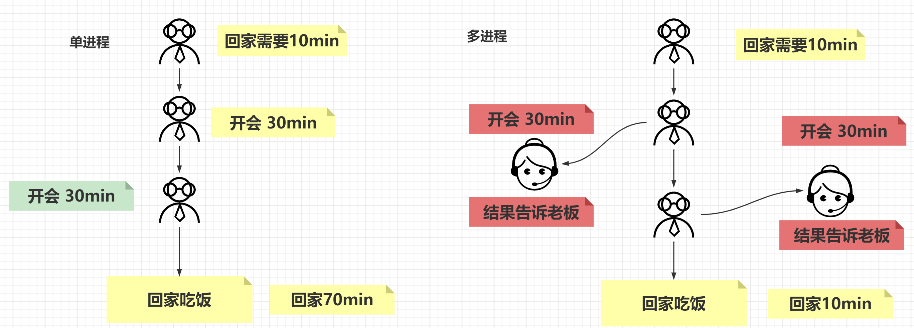
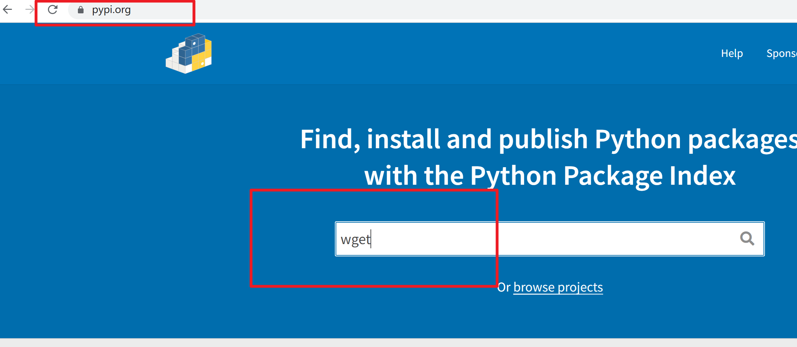
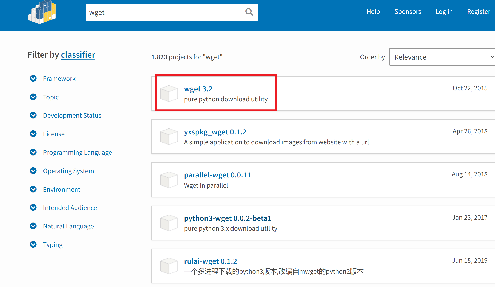
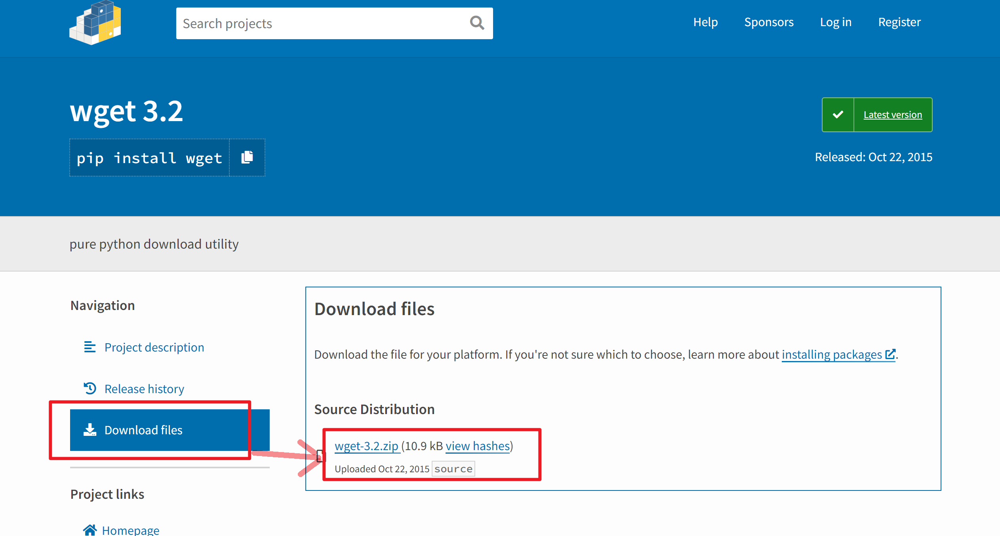

[TOC]

# 进程和线程

## 概念

### 进程

> 1. **计算机程序只不过是磁盘中可执行的二进制（或其他类型）的数据**
> 2. **进程（有时被称为重量级进程）是程序的一次执行**
> 3. **每个进程都有自己的地址空间、内存以及其它记录其运行轨迹的辅助数据（称之为上下文 context）**
> 4. **操作系统管理在其上运行的所有进程，并为这些进程公平分配时间（CPU）**

### 线程

> 1. **线程（有时被称为轻量级进程）跟进程有些类似，不同的是所有线程运行在同一个进程中，共享相同的运行环境**
> 2. **一个进程中的各个线程之间共享同一片数据空间，所以线程之间可以比进程之间更方便的共享数据以及相互通讯**

### 理解（人话）


### 总结

1. **进程是争夺 CPU 资源的最小单位，线程是程序执行的最小单位**
2. **线程的执行离不开进程的资源，进程的流转离不开线程的工作**

## 多线程

### 动机

- 在多线程（MT）编程出现之前，电脑程序的运行由 **一个执行序列组成**，执行序列按顺序在主机的**中央处理器（CPU）中运行**
- 无论是任务本身要求**顺序执行还是整个程序是由多个子任务组成**，程序都是按这种方式执行的
- **即使子任务相互独立，互相无关（即，一个子任务的结果不影响其它子任务的结果）时也是这样**
- 如果并行运行这些相互独立的子任务可以大幅度地 **提升整个任务的效率**

### 工作特点

- 它们本质上就是 **异步的**，需要有多个并发事务
- 各个事务的运行顺序可以是 **不确定的，随机的，不可预测的**
- 这样的编程任务可以被分成 **多个执行流，每个流都有一个要完成的目标**
- **根据应用的不同，这些子任务可能都要计算出一个中间结果，用于合并得到最后的结果**

### 理解



### 多线程编程

#### 概念

- **thread 和 threading **模块允许程序员创建和管理线程
- **thread** 模块提供了基本的线程和锁的支持，**而 threading 提供了更高级别、功能更强的线程管理功能**
- 推荐使用更高级别的 **threading** 模块

#### 使用

- 多线程编程有多种方法，传递函数给threading模块的Thread类是介绍的第一种方法
- **Thread** 对象使用 **start()** 方法开始线程的执行，直到线程结束

#### 案例：三秒后打印内容

**需求：使用多线程实现功能**

**【一般方法】**

```python
import time

# 定义方法say_hi()，功能: 打印信息
def say_hi():
    time.sleep(3)
    print('Hello World!')

if __name__ == '__main__':
# 当前处于主线程下，通过for循环生成工作线程t, target指定线程运行的函数
    for i in range(3):
        say_hi()
```

**【多线程】**

```python
import time
import threading

# 导入多线程的模块
import  threading

# 定义方法say_hi()，功能: 打印信息
def say_hi():
    time.sleep(3)
    print('Hello World!')

if __name__ == '__main__':
# 当前处于主线程下，通过for循环生成工作线程t, target指定线程运行的函数
    for i in range(3):
        t = threading.Thread(target=say_hi)
        t.start()     #启动工作线程, 会运行target()【等同于say_hi()】
```

#### 练习 1：扫描存活主机

**需求：**

1. 通过 **ping** 测试主机是否可达
2. 如果 **ping** 不通，不管什么原因都认为主机不可用
3. **通过多线程方式实现并发扫描**

**分析：**

- subprocess.run() 方法可以调用系统命令，其返回值是系统命令退出码，也就是如果系统命令成功执行，返回0，如果没有成功执行，返回非零值

```python
import subprocess
import threading
def ping(host):
    result = subprocess.run(
        'ping -c2 %s &> /dev/null' % host,
        shell=True
    )
    if result.returncode == 0:
        print('%s: up' % host)
    else:
        print('%s: down' % host)
if __name__ == '__main__':
    ips = ['172.40.58.%s' % i for i in range(1, 255)]
    for ip in ips:
        # 创建线程，ping是上面定义的函数, args是传给ping函数的参数
        t = threading.Thread(target=ping, args=(ip,))
        t.start()  # 执行ping(ip)
```

# Python 模块安装

## 通过pip本地安装python模块

- **pip** 是 **Python** 包管理工具
- 提供了对 **Python** 包的查找、下载、安装、卸载的功能
- 下载模块后解压缩并安装

### 步骤

#### 下载模块







#### 安装

上传 wget-3.2.zip 到 pycharm 主机

```shell
[root@localhost ~]# unzip wget-3.2.zip  # 解压
[root@localhost ~]# cd wget-3.2/  # 进入到wget解压目录下
[root@localhost wget-3.2]# python3 setup.py install  # 安装wget
[root@localhost wget-3.2]# pip3 list |grep -i wget  # 查看wget的版本
```

### 在线安装模块

#### 使用国内镜像站点

```shell
[root@localhost xxx]# mkdir ~/.pip			#在root家目录下，创建隐藏目录.pip
[root@localhost xxx]# vim ~/.pip/pip.conf		#创建，配置国内镜像源，index-url 指定国内镜像源路径，trusted-host 信任该镜像网站，否则无法使用
[global]
index-url=https://mirrors.aliyun.com/pypi/simple/
[install]
trusted-host=mirrors.aliyun.com
```

#### 安装

使用pip尝试安装，可以看到配置的国内镜像站点

```shell
[root@localhost xxx]# pip3 install wget
```

# 邮件编程

## 在Linux的终端上，查看邮件服务器是否开启

```shell
rpm -q postfix || yum -y install postfix
yum -y install mailx
systemctl start postfix
netstat -utnlp | grep :25
vim /etc/hosts  # 把自己的主机名和127地址绑定
127.0.0.1 xxx localhost
:wq!

[root@localhost xx]# useradd bob
[root@localhost xx]# useradd alice

```

## 发送并设置邮件

标准邮件需要三个头部信息

- From：发件人
- To：收件人
- Subject：主题

## SMTP

### 概念

- SMTP（Simple Mail Transfer Protocol） 即简单邮件传输协议，使用 TCP 协议 25 端口
- 它是一组用于由源地址到目的地址传送邮件的规则，由它来控制信件的中转方式
- python 的 **smtplib** 提供了一种很方便的途径发送电子邮件。它对 **smtp 协议进行了简单的封装**

### SMTP对象

- Python 发送邮件，**第一步是创建 SMTP 对象**
- 创建 SMTP 对象也可以不给定参数，之后再通过对象的其他方法进行绑定

### sendmail 方法

- Python SMTP 对象使用 **sendmail** 方法发送邮件
- sendmail 方法三个必须的参数有：
  - **收件人**
  - **发件人**
  - **消息主体 msg 是一个字符串，表示邮件**

- 将准备好的邮件发送

## 案例：通过本机发送邮件

### 准备工作

1. 创建 **bob** 和 **alice** 账号
2. 编写发送邮件程序，发件人为 **root**，收件人是本机的 **bob **和 **alice** 账号

```shell
[root@localhost xxx]# useradd bob  # 创建接收邮件的用户bob和alice
[root@localhost xxx]# useradd alice
[root@localhost xxx]# mail -u bob  # 查看用户bob的邮件，成功
[root@localhost xxx]# mail -u alice
```

### 代码编写

```python
# local_mail.py，使用本机的root用户，发送邮件给bob和alice用户  
from email.mime.text import  MIMEText  # 导入邮件主体内容的类
from  email.header import Header  # 导入邮件头部信息的类
import  smtplib	 # 导入发送邮件的模块

msg = MIMEText('python 本地邮件测试\n', 'plain', 'utf8')  # 定义文件的内容；'plain' 表示纯文本【类似vim 编写的文件】，富文本【包含图片，字体颜色等】，文本类型为'utf8'
msg['From'] = Header('发送者', 'utf8')  # 声明邮件的发件人，类型为'utf8'
msg['To'] = Header('接收者们', 'utf8')  # 声明接收邮件方，类型为'utf8'
msg['Subject'] = Header('py test', 'utf8')  # 声明邮件的主题【标题】
smtp = smtplib.SMTP('127.0.0.1')  # 创建对象，声明发送邮件的服务器
sender = 'root'  # 声明发送邮件的用户
receivers = ['bob', 'alice']  # 声明接收邮件的用户，发送邮件给多个用户，用列表表示
# 从当前本机的邮件服务器上，发送邮件，指定发件人，接收方，发送的邮件【包含邮件主体，发件人，收件人，邮件标题】
# msg.as_bytes() 指定以字节的方式发送邮件
smtp.sendmail(sender, receivers, msg.as_bytes())
```
